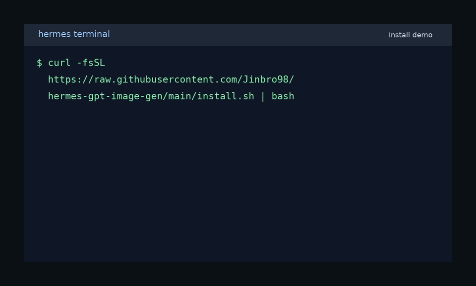
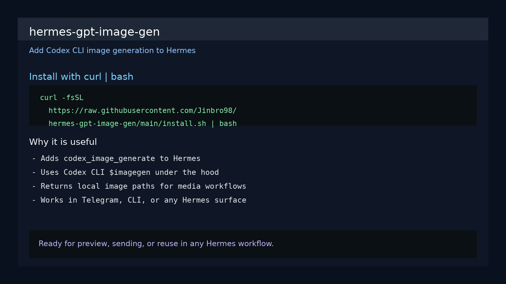

# hermes-gpt-image-gen

[English](README.md)

[](https://github.com/Jinbro98/hermes-gpt-image-gen/releases)
[](LICENSE)
[](https://github.com/Jinbro98/hermes-gpt-image-gen)
[](https://developers.openai.com/codex/cli/features/)

**Hermes Agent**용 Codex CLI 기반 이미지 생성 플러그인입니다.

이 플러그인은 Hermes에 `codex_image_generate` 도구를 추가합니다. 내부적으로 Codex CLI의 `$imagegen`을 실행하고, 결과 이미지를 **로컬 파일**로 저장한 뒤 절대 경로를 반환하므로 CLI/로컬 워크플로우에서 재사용하거나 Telegram에서 `MEDIA:/absolute/path` 형식으로 바로 전송할 수 있습니다.

또한 아래와 같은 명시적 요청이 들어오면 Codex 기반 이미지 생성 흐름을 우선 사용하도록 라우팅 힌트를 추가합니다.

- `덕테이프로 ... 이미지 생성해줘`
- `코덱스로 ... 이미지 생성해줘`
- `gpt로 ... 이미지 생성해줘`

---

## 미리보기

### 설치 데모 GIF



### 설치 스크린샷



---

## 주요 기능

- Hermes에 `codex_image_generate` 도구 추가
- 호스팅 이미지 URL 백엔드 대신 **Codex CLI**로 이미지 생성
- Telegram, CLI, 기타 Hermes 워크플로우에 활용 가능한 로컬 파일 경로 반환
- `landscape`, `square`, `portrait` 비율 지원
- `auto`, `transparent`, `opaque` 배경 옵션 지원
- 선택 사항: Hermes 기본 `image_generate`를 Codex 기반 구현으로 교체 가능
- Codex/GPT 계열 이미지 생성 요청에 대한 트리거 기반 라우팅 지원
- 핫패스에서 `codex features list`를 반복 호출하지 않도록 Codex 기능 확인 결과 캐시
- 작업 디렉터리에서 **새로 생기거나 변경된** 이미지 파일만 추적하여 결과 파일을 더 안전하게 판별
- 안전한 경우 단일 대체 이미지 파일을 요청한 파일명으로 자동 변경
- 사후 분석을 위해 `stdout`, `stderr`, `result.txt` 디버그 아티팩트를 디스크에 저장
- 오래된 자동 생성 임시 작업 디렉터리를 주기 제한(throttled interval) 하에 정리
- 캐시, 출력 판별, 디버그 아티팩트, 임시 디렉터리 정리를 검증하는 pytest 테스트 포함

---

## 요구 사항

설치 전에 아래 항목을 확인하세요.

1. **Hermes Agent**가 이미 설치되어 있어야 합니다.
2. **Codex CLI**가 설치되어 있고 `PATH`에서 실행 가능해야 합니다.
3. Codex 이미지 생성 기능이 활성화되어 있어야 합니다.
4. Codex 인증이 정상 상태여야 합니다.

권장 확인 명령:

```bash
codex --version
codex features list | grep '^image_generation'
```

정상이라면 아래와 비슷한 출력이 보여야 합니다.

```bash
image_generation stable true
```

인증이 꼬였으면 먼저 다시 로그인하세요.

```bash
codex logout
codex login
```

---

## 원라인 설치

```bash
curl -fsSL https://raw.githubusercontent.com/Jinbro98/hermes-gpt-image-gen/main/install.sh | bash
```

이제 설치 스크립트는 기본적으로 아래 위치에 모두 배포합니다.

- 기본 Hermes 홈 플러그인 디렉터리 (`~/.hermes/plugins/codex_image_gen`)
- `~/.hermes/profiles/*/plugins/codex_image_gen` 아래의 모든 기존 프로필

즉, 한 번 설치하면 현재 프로필과 다른 기존 Hermes 프로필에도 함께 반영됩니다.

하나의 커스텀 위치에만 설치하고 싶다면 먼저 `HERMES_GPT_IMAGE_GEN_DIR`을 지정하세요.

```bash
HERMES_GPT_IMAGE_GEN_DIR="$HERMES_HOME/plugins/codex_image_gen" \
  curl -fsSL https://raw.githubusercontent.com/Jinbro98/hermes-gpt-image-gen/main/install.sh | bash
```

설치 후에는 Hermes를 재시작하거나 새 세션을 시작해야 플러그인이 로드됩니다.

---

## 수동 설치

### 모든 기존 Hermes 프로필에 설치

```bash
curl -fsSL https://raw.githubusercontent.com/Jinbro98/hermes-gpt-image-gen/main/install.sh | bash
```

### 현재 프로필 하나에만 설치

```bash
mkdir -p "$HERMES_HOME/plugins/codex_image_gen"
curl -fsSL https://raw.githubusercontent.com/Jinbro98/hermes-gpt-image-gen/main/plugin.yaml -o "$HERMES_HOME/plugins/codex_image_gen/plugin.yaml"
curl -fsSL https://raw.githubusercontent.com/Jinbro98/hermes-gpt-image-gen/main/__init__.py -o "$HERMES_HOME/plugins/codex_image_gen/__init__.py"
```

그 다음 Hermes를 재시작하거나 세션을 리셋하세요.

---

## 사용 방법

플러그인이 로드되면 Hermes는 아래 도구를 사용할 수 있습니다.

- `codex_image_generate`

예시 payload:

```json
{
  "prompt": "투명 배경의 플랫컬러 귤 아이콘을 만들어줘.",
  "aspect_ratio": "square",
  "background": "transparent",
  "file_name": "tangerine.png"
}
```

성공 시 반환되는 주요 값:

- `image_path`
- `file_name`
- `output_dir`
- `stdout_path`
- `stderr_path`
- `result_path`

Telegram 전송 예시:

```text
MEDIA:/absolute/path/to/tangerine.png
```

---

## 트리거 문구

이 플러그인은 명시적인 Codex/GPT 스타일 이미지 생성 요청이 들어오면 라우팅 컨텍스트를 주입합니다.

예시:

- `코덱스로 칠판 이미지 생성해줘`
- `gpt로 귤 아이콘 만들어줘`
- `덕테이프로 강아지 일러스트 제작해줘`

라우팅 힌트는 아래 조건일 때만 활성화됩니다.

- 메시지에 `덕테이프로`, `코덱스로`, `gpt로` 같은 엔진 표현이 포함됨
- 동시에 실제 이미지 생성 요청처럼 보이는 문장이어야 함

---

## 선택 사항: 기본 `image_generate` 교체

Codex CLI가 Hermes 기본 `image_generate`를 대체하게 하려면 **Hermes 시작 전에** 아래 환경 변수를 설정하세요.

```bash
export HERMES_CODEX_IMAGEGEN_OVERRIDE=1
```

이 변수가 켜져 있으면 플러그인이 기존 `image_generate`를 deregister한 뒤, 같은 이름으로 Codex 기반 구현을 다시 등록합니다.

---

## 선택적 환경 변수

아래 환경 변수는 필수는 아니지만, 안정성 동작을 조정할 때 유용합니다.

```bash
# override 모드 활성화
export HERMES_CODEX_IMAGEGEN_OVERRIDE=1

# Codex 기능 확인 결과를 5분간 캐시 (기본값: 300)
export HERMES_CODEX_IMAGEGEN_REQUIREMENTS_TTL=300

# 24시간보다 오래된 자동 생성 임시 작업 디렉터리 삭제 (기본값: 86400)
export HERMES_CODEX_IMAGEGEN_TEMP_DIR_MAX_AGE=86400

# 오래된 임시 디렉터리 정리를 최대 1시간에 1번만 수행 (기본값: 3600)
export HERMES_CODEX_IMAGEGEN_CLEANUP_INTERVAL=3600
```

---

## 안정성 관련 변경 사항

### 더 안전한 출력 파일 판별

이제 플러그인은 Codex를 실행하기 전에 기존 이미지 파일 상태를 스냅샷으로 기록하고, 실행 후에는 **새로 생기거나 변경된** 이미지 파일만 결과 후보로 인정합니다. 따라서 재사용 중인 `output_dir` 안의 오래된 파일이 최신 생성 결과로 잘못 선택되는 문제를 줄였습니다.

Codex가 요청한 파일명을 무시했더라도 새 이미지 파일이 정확히 1개만 생기고 확장자가 호환되면, 그 파일을 요청한 파일명으로 변경합니다. 반대로 기대한 파일명 없이 새 이미지가 여러 개 생기면, 가장 최근 파일을 임의 선택하지 않고 명시적인 모호성 오류를 반환합니다.

### 디버그 아티팩트

이제 모든 Codex 실행은 출력 디렉터리에 아래 파일을 남깁니다.

- `codex.stdout.log`
- `codex.stderr.log`
- `result.txt`

이 파일들의 절대 경로는 도구 결과의 `stdout_path`, `stderr_path`, `result_path`로 함께 반환됩니다.

### 임시 작업 디렉터리 정리

`output_dir`을 지정하지 않으면 여전히 매 실행마다 새 임시 디렉터리를 만들지만, 오래된 임시 작업 디렉터리가 무한정 쌓이지 않도록 주기 제한 하에 정리도 함께 수행합니다.

---

## 테스트

테스트 실행 명령:

```bash
pytest tests/test_plugin.py -q
```

---

## 저장소 구성

이 저장소는 배포에 필요한 최소 파일과 테스트만 포함합니다.

```text
assets/
  install-demo.gif
  install-screenshot.png
tests/
  test_plugin.py
plugin.yaml
__init__.py
README.md
README.ko.md
install.sh
LICENSE
```

---

## 문제 해결

### 플러그인을 설치했는데 Hermes가 사용하지 않음

Hermes/gateway를 재시작하거나 새 세션을 시작하세요.

### `Codex CLI not found in PATH`

Hermes가 실행되는 동일한 환경에서 `codex` 명령이 실행 가능한지 확인하세요.

### `image_generation`을 사용할 수 없음

Codex CLI를 업그레이드하고 인증 상태를 다시 확인하세요.

### Codex 인증 오류가 발생함

아래 명령으로 재로그인해 보세요.

```bash
codex logout
codex login
```

---

## 라이선스

MIT
